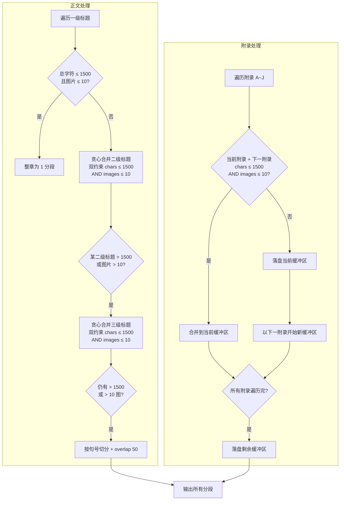
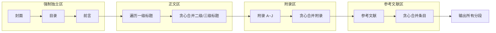

# 知识库文档切分策略（优化版）

## 一、切分总原则

**每个分段（chunk）在语义上必须是完整、独立的，并且只属于一个明确的章节层级。**

**禁止**：任意分段包含两个一级标题的内容。

---

## 二、文档结构预定义

本标准文档的结构可划分为以下固定区域，各区域**独立分段，互不合并**：

| 区域 | 包含内容 | 切分方式 |
|------|----------|----------|
| **封面** | 标准名称、标准编号、发布/实施信息、ICS/CCS 等 | 整体作为 **1 个分段** |
| **目录** | 目次页全部内容 | 整体作为 **1 个分段** |
| **前言** | 前言全部内容 | 整体作为 **1 个分段** |
| **正文** | 从 `1 范围` 到 `4.11 卫生间` 的全部章节 | 按下方正文切分规则处理 |
| **附录** | 附录 A 到附录 J（含标题、说明文字、图片） | 按下方附录切分规则处理 |
| **参考文献** | 本标准无此部分，若有则单独分段 | 整体作为 1 个分段 |

---

## 三、正文切分规则

正文区域指从 **`1 范围`** 到 **`4.11 卫生间`** 的所有内容。

### 规则 3.1：以一级标题为基本分段单位

- **每个一级标题（level=1）独立成为 1 个分段的开头**。
- 一个分段**只能包含 1 个一级标题**，禁止将两个一级标题合并到同一个分段。

本标准的一级标题包括：
```
1 范围
2 规范性引用文件
3 术语和定义
4 功能单元视觉设计标准
```

### 规则 3.2：一级标题内容长度判断

将每个一级标题下的**全部内容（含其下属的二级标题及正文）** 累加计算字符数。

| 条件 | 处理方式 |
|------|----------|
| 总字符数 **≤ 1500** | 整体作为 **1 个分段**，不拆分 |
| 总字符数 **> 1500** | 按下属的**二级标题**进一步拆分 |

好的，我理解了你的修改意图。核心变化是：

1. **二级标题可以合并**：多个二级标题及其下属内容可以合并成同一个分段，只要总字符数不超过 1500。
2. **分段边界仍在二级标题处**：禁止从二级标题中间截断。

---

### 规则 3.3：二级标题拆分规则（含合并）

当一级标题内容超过 1500 字符、需要按二级标题拆分时，采用**贪心合并**策略：

**核心原则**：
- 分段边界**必须落在二级标题处**，禁止从二级标题中间截断。
- **多个二级标题可以合并到同一个分段中**，只要合并后的总字符数不超过 1500。
- 每个分段可包含 **1 个或多个完整的二级标题**。

**合并策略（贪心算法）**：
1. 按顺序遍历该一级标题下的所有二级标题。
2. 将当前二级标题加入缓冲区。
3. 若**缓冲区总字符数 + 下一个二级标题的字符数 ≤ 1500**，则继续合并。
4. 若**加上下一个会超过 1500**，则当前缓冲区落盘为一个分段，然后以下一个二级标题开始新缓冲区。

#### 示例

`4 功能单元视觉设计标准` 包含以下二级标题及其预估字符数：

| 二级标题 | 预估字符数 |
|----------|------------|
| 4.1 基本原则 | 200 |
| 4.2 入口外观 | 350 |
| 4.3 候诊区 | 400 |
| 4.4 诊室 | 350 |
| 4.5 中医区 | 200 |
| 4.6 预防保健区 | 450 |
| 4.7 B超、心电图室 | 300 |
| 4.8 药房 | 250 |
| 4.9 留观室 | 300 |
| 4.10 住院部 | 500 |
| 4.11 卫生间 | 800 |

**拆分结果**：

```
分段 1: 4.1 基本原则(200) + 4.2 入口外观(350) = 550 字符 ✅
分段 2: 4.3 候诊区(400) + 4.4 诊室(350) + 4.5 中医区(200) = 950 字符 ✅
分段 3: 4.6 预防保健区(450) + 4.7 B超、心电图室(300) + 4.8 药房(250) = 1000 字符 ✅
分段 4: 4.9 留观室(300) + 4.10 住院部(500) = 800 字符 ✅
分段 5: 4.11 卫生间(800) = 800 字符 ✅
```

如果合并后仍超过 1500（如 `4.11 卫生间` 单独超过 1500），则进入规则 3.4。

### 规则 3.4：单个二级标题内容超长处理

若**某个二级标题及其下属内容单独超过 1500 字符**，采用以下方式处理：

| 情况 | 条件 | 处理方式 |
|------|------|----------|
| **情况一** | 内容有明确的子条目（如 `4.11.1`、`4.11.2` 三级标题） | 按三级标题边界拆分，**多个三级标题可以合并**到同一分段中，采用**贪心合并策略**（同规则 3.3），合并后总字符数不超过 1500。若单个三级标题仍超 1500，按情况二处理。 |
| **情况二** | 内容是连续的段落文本，无明确编号结构 | 在最近的**句号（。）** 处切分，切分后每个分段控制在 **800~1500 字符**，并添加 **overlap 100 字符**（上段末尾 100 字符重复到下段开头）。 |

---

#### 情况一示例

假设 `4.11 卫生间` 包含以下三级标题：

| 三级标题 | 预估字符数 |
|----------|------------|
| 4.11.1 标识牌 | 100 |
| 4.11.2 环境要求 | 200 |
| 4.11.3 门朝向 | 150 |
| 4.11.4 呼叫铃 | 200 |
| 4.11.5 输液挂钩与平台 | 300 |
| 4.11.6 挂钩与网栏 | 200 |
| 4.11.7 蹲式大便器 | 250 |
| 4.11.8 无障碍厕位 | 300 |
| 4.11.9 手卫生设施 | 200 |
| 4.11.10 儿童厕位 | 250 |

**贪心合并结果（阈值 1500，所有条目总字符数 2150）**：

```
分段 1: 4.11.1(100) + 4.11.2(200) + 4.11.3(150) + 4.11.4(200) + 4.11.5(300) = 950 字符 ✅
分段 2: 4.11.6(200) + 4.11.7(250) + 4.11.8(300) + 4.11.9(200) + 4.11.10(250) = 1200 字符 ✅
```

---

### 规则 3.5：图片数量超限切分 ★ 2026-07-31 新增

**背景**：Dify 服务端通过 `SINGLE_CHUNK_ATTACHMENT_LIMIT` 环境变量限制单段 `attachment_ids` 数量（**默认 10**）。当某段图片数 > 10 时，`add_segments` 会返回 400：
```
Exceeded maximum attachment limit of 10
```
仅靠"字符数 ≤ 1500"的合并条件无法避免此问题——某些章节（典型例子：WST 809 文档的 `4.11 卫生间` 内嵌 13 张图）单段字符数可能只有 800，但图片数远超 10。

**解决**：在贪心合并的"字符数"条件之外，**增加"图片数"维度**作为第二约束。

#### 3.5.1 阈值与默认值

| 参数 | 默认值 | 来源 |
|------|--------|------|
| 单段最大图片数 | **10** | `settings.chunk_max_images_per_segment`（与 Dify `SINGLE_CHUNK_ATTACHMENT_LIMIT` 对齐） |

自托管 Dify 如调大了 `SINGLE_CHUNK_ATTACHMENT_LIMIT`，可同步调大此配置。

#### 3.5.2 合并条件（双约束）

对规则 3.3 / 3.4 / 3.5.1 的贪心合并，统一改为**双约束**：

```
加入下一组 N 的判定 = 
    (累计字符数 + N.字符数 ≤ 1500)
    AND
    (累计图片数 + N.图片数 ≤ chunk_max_images_per_segment)
```

任一条件不满足 → 当前缓冲区落盘，N 起新缓冲区。

#### 3.5.3 单组就超 max_images 的处理

**重要例外**：如果单组（一个 L2 / L3 / 附录）本身就超过 `max_images` 张图：

- **不强行拆图**——避免与"图片必须与上下文文本保持在一起"（规则 5.2）冲突。
- **原样保留**为 1 个段，超出 Dify 上限的图片暂存于该段。
- **降级策略**：入库阶段（dify_ingest）会捕获 400 错误并把超出上限的图片降级为 URL-only 模式（不进 `attachment_ids`），保证入库不中断。

#### 3.5.4 示例

`4.11 卫生间` 包含 13 张图，按规则 3.4 情况一贪心合并，假设分到 1 个段：
- 字符数：950 ✅
- 图片数：13 ❌ > 10

**按规则 3.5.2 双约束切分后**：

```
分段 14a: 4.11.1~4.11.5（950 字符，6 张图）✅
分段 14b: 4.11.6~4.11.7（450 字符，4 张图）✅  
分段 14c: 4.11.8~4.11.10（750 字符，3 张图）✅
```

每段图片数均 ≤ 10，可正常 `add_segments` 入库。

#### 3.5.5 与原有规则的关系

| 规则 | 优先级 | 说明 |
|------|--------|------|
| 3.1 一级标题独立分段 | 高 | 不可绕过 |
| 3.3 / 3.4 字符数 ≤ 1500 | 高 | 不可绕过 |
| **3.5 图片数 ≤ max_images** | **高** | **与字符数并列为硬约束** |
| 5.2 图片上下文完整性 | 高 | 单组超 max_images 时遵守 5.2（不拆图） |
| 5.1 图片不独立成段 | 中 | 单组内多图可合并在同一段 |

---

### 修正后的完整正文切分流程图

```mermaid
flowchart TD
    A[遍历一级标题] --> B{该一级标题\n总字符数 ≤ 1500\n且图片数 ≤ 10?}
    B -->|是| C[整个一级标题作为 1 个分段]
    B -->|否| D[遍历其下属二级标题]
    D --> E[贪心合并二级标题]\n双约束：chars ≤ 1500\nAND images ≤ 10
    E --> F[落盘为 1 个分段]
    F --> G{还有剩余\n二级标题?}
    G -->|是| E
    G -->|否| H{某个二级标题\n单独 > 1500\n或图片 > 10?}
    H -->|是| I{有三级标题?}
    I -->|有| J[贪心合并三级标题]\n双约束：chars ≤ 1500\nAND images ≤ 10
    J --> K[落盘为 1 个分段]
    K --> L{还有剩余\n三级标题?}
    L -->|是| J
    L -->|否| M[完成]
    I -->|无| N[按句号切分]\n+ overlap 100 字符
    H -->|否| M
```

---

### 校验标准补充

| 检查项 | 要求 |
|--------|------|
| 分段内标题合并 | 允许包含多个二级或三级标题，但总字符数 ≤ 1500 |
| **单段图片数（2026-07 新增）** | **image_refs 数量 ≤ settings.chunk_max_images_per_segment（默认 10）** |
| 分段边界完整性 | 边界必须落在二级或三级标题处（情况二除外） |
| 超长标记 | 情况二切分的分段，metadata 中标记 `is_split: true` |
| 层级一致性 | 同一分段内不允许混合二级和三级标题（即二级标题合并只在同层级进行，三级标题合并只在三级内部进行） |
| **双约束合并（2026-07 新增）** | **贪心合并时同时校验 chars ≤ 1500 AND images ≤ max_images，任一不满足即落盘** |

---

### 重要补充：层级一致性

在进行贪心合并时，需要遵循**同层级合并**原则：

| 合并层级 | 允许合并的对象 | 禁止行为 |
|----------|----------------|----------|
| 一级标题 | 不合并，每个一级标题是独立分段单位 | 禁止两个一级标题合并 |
| 二级标题 | 同一父级下的多个二级标题可以合并 | 禁止与三级标题混合合并 |
| 三级标题 | 同一父级下的多个三级标题可以合并 | 禁止与二级标题混合合并 |

**示例**：`4.11 卫生间` 下的三级标题只能和 `4.11` 下的三级标题合并，不能跨到 `4.10 住院部` 或与 `4.11` 的二级标题合并。

---

## 四、附录切分规则

附录区域指从 **`附录 A`** 到 **`附录 J`** 的全部内容（含标题、说明文字、图片及其图注）。

### 规则 4.1：附录合并策略（贪心合并）

- **多个附录可以合并**到同一个分段中，采用**贪心合并策略**（同正文规则 3.3）。
- 按顺序遍历附录 A 到附录 J，将当前附录加入缓冲区。
- 若**缓冲区总字符数 + 下一个附录的字符数 ≤ 1500**，则继续合并。
- 若**加上下一个会超过 1500**，则当前缓冲区落盘为一个分段，然后以下一个附录开始新缓冲区。
- 附录之间不强制拆分，合并后的分段总字符数不超过 1500。

**每个分段内容包含**：附录标题 + 说明文字（如有）+ 图片引用占位符 + 图注。

#### 示例

各附录预估字符数：

| 附录 | 预估字符数 |
|------|------------|
| 附录 A 入口外观效果示例 | 200 |
| 附录 B 候诊区效果示例 | 200 |
| 附录 C 诊室效果示例 | 200 |
| 附录 D 中医区效果示例 | 200 |
| 附录 E 预防保健区效果示例 | 200 |
| 附录 F B超、心电图室效果示例 | 200 |
| 附录 G 药房效果示例 | 200 |
| 附录 H 留观室效果示例 | 200 |
| 附录 I 住院部效果示例 | 250 |
| 附录 J 卫生间效果示例 | 200 |

**贪心合并结果（阈值 1500）**：

```
分段 1: 附录 A(200) + 附录 B(200) + 附录 C(200) + 附录 D(200) + 附录 E(200) + 附录 F(200) = 1200 字符 ✅
分段 2: 附录 G(200) + 附录 H(200) + 附录 I(250) + 附录 J(200) = 850 字符 ✅
```

如果某个附录**单独超过 1500 字符**（极少情况，除非包含大量文字描述），则按规则 4.2 处理。

---

### 规则 4.2：单个附录超长处理

若**某个附录单独超过 1500 字符**，采用以下方式处理：

| 情况 | 条件 | 处理方式 |
|------|------|----------|
| **情况一** | 附录内有明确的自然子章节（如多个图片分组） | 按子章节边界拆分，**多个子章节可以合并**（贪心合并，阈值 1500）。若单个子章节仍超长，按情况二处理。 |
| **情况二** | 附录内是连续的说明文字（无明确子结构） | 在最近的**句号（。）处切分**，切分后每个分段控制在 **600~1000 字符**，并添加 **overlap 50 字符**。 |

---

### 规则 4.3：附录图片数量超限切分 ★ 2026-07-31 新增

**背景**：附录通常是大段"图集"性质内容（例：附录 A「入口外观效果示例」可能含 6 张图），多附录合并后单段图片数极易突破 10 张上限。WST 809 实际场景：附录 A~F 合并后共 18 张图，必须拆成 2 段才能满足 Dify `SINGLE_CHUNK_ATTACHMENT_LIMIT`。

**解决**：附录的贪心合并条件同样升级为**双约束**（字符 + 图片）。

#### 4.3.1 合并条件

```
加入下一附录 N 的判定 = 
    (累计字符数 + N.字符数 ≤ 1500)
    AND
    (累计图片数 + N.图片数 ≤ chunk_max_images_per_segment)
```

#### 4.3.2 单附录就超 max_images 的处理

与正文 3.5.3 一致：单附录超 10 张图时**不强行拆图**，原样保留 1 段。入库阶段降级。

#### 4.3.3 示例

| 附录 | 字符数 | 图片数 |
|------|--------|--------|
| 附录 A 入口外观效果示例 | 200 | 3 |
| 附录 B 候诊区效果示例 | 200 | 3 |
| 附录 C 诊室效果示例 | 200 | 3 |
| 附录 D 中医区效果示例 | 200 | 3 |
| 附录 E 预防保健区效果示例 | 200 | 3 |
| 附录 F B超、心电图室效果示例 | 200 | 3 |
| 附录 G 药房效果示例 | 200 | 3 |
| 附录 H 留观室效果示例 | 200 | 3 |
| 附录 I 住院部效果示例 | 250 | 3 |
| 附录 J 卫生间效果示例 | 200 | 2 |

**按 4.1 字符数合并结果（阈值 1500）**：
```
分段 1: A+B+C+D+E+F = 1200 字符 ✅
分段 2: G+H+I+J = 850 字符 ✅
```

**按 4.3.1 双约束合并结果（字符 ≤ 1500 AND 图片 ≤ 10）**：
```
分段 1: A+B+C = 600 字符, 9 张图 ✅
分段 2: D+E+F = 600 字符, 9 张图 ✅
分段 3: G+H+I = 650 字符, 9 张图 ✅
分段 4: J = 200 字符, 2 张图 ✅
```

每段图片数均 ≤ 10，避免 Dify 400 错误。

#### 4.3.4 与 4.1 的关系

| 规则 | 作用 |
|------|------|
| 4.1 字符数 ≤ 1500 | 仍为硬约束 |
| **4.3 图片数 ≤ max_images** | **新增强约束** |
| 二者关系 | **AND**——任一不满足即落盘 |

**实际效果**：当 `chunk_max_images_per_segment = 10` 时，附录合并会更"碎"（例：原 4 段 → 新 6 段），但保证入库不因图片超限而失败。

---

### 附录与正文的衔接处理

| 衔接点 | 处理方式 |
|--------|----------|
| 正文最后一段 → 附录 | 正文结束后，若缓冲区非空则落盘。附录从新分段开始，不与正文合并。 |
| 附录之间 | 按规则 4.1 贪心合并，不超过 1500 字符。 |
| 附录 → 无后续内容 | 最后一个附录落盘后结束。 |

---

### 修正后的完整切分流程图



---

### 校验标准补充

| 检查项 | 要求 |
|--------|------|
| 附录合并 | 允许多个附录合并，总字符数 ≤ 1500 |
| **单段图片数（2026-07 新增）** | **附录合并后单段 image_refs ≤ settings.chunk_max_images_per_segment（默认 10）** |
| 附录边界 | 分段边界必须落在附录标题处（情况二除外） |
| 正文与附录隔离 | 正文与附录**不合并**到同一分段 |
| 超长标记 | 情况二切分的分段，metadata 中标记 `is_split: true` |
| **双约束合并（2026-07 新增）** | **附录贪心合并时同时校验 chars ≤ 1500 AND images ≤ max_images** |

---

### 附录分段数据结构示例

```json
{
  "content": "附 录 A（资料性）入口外观效果示例\n入口外观效果示例见图A.1。[图: 图A.1 入口外观效果图]\n\n附 录 B（资料性）候诊区效果示例\n候诊区效果示例见图B.1。[图: 图B.1 候诊区效果图]",
  "metadata": {
    "title_path": "附录 A ~ 附录 B",
    "chunk_type": "appendix",
    "appendix_list": ["附录 A", "附录 B"],
    "page_num": [6, 7],
    "image_paths": ["images/60de63a2...jpg", "images/9c1483e7...jpg"],
    "char_count": 600
  }
}
```

## 五、图片内联处理规则

### 规则 5.1：图片直接内联

- **图片不独立成段**，直接保留在切分后的文本内容中。
- **保留 MD 原生图片语法**：``，不进行任何格式转换（不替换为 `[图: ...]` 占位符）。
- 切分时，图片与它所属的文本块一起被切分到同一个分段中。

#### 示例

原文 MD 内容：
```markdown
入口外观效果示例见图A.1。


图 A.1 入口外观效果图
```

切分后的分段内容：
```markdown
# 4.2 入口外观

入口外观效果示例见图A.1。


图 A.1 入口外观效果图
```


### 规则 5.2：图片切分归属

- 图片归属于**其所在位置最近的标题路径**。
- 当切分边界落在图片之前或之后时，**图片必须与其上下文文本保持在一起**，不得被分离到不同的分段中。
- 切分点优先选择**段落边界**（标题处、句号处），避免切在图片的前后，确保图片和其上下文完整。


### 规则 5.3：切分后文件夹组织结构

每个文档切分完成后，生成如下文件夹结构：

```
{WST 809—2022}/                        # 以文档命名的根文件夹
├── images/                            # 图片文件夹
│   ├── 60de63a2...jpg
│   ├── 9c1483e7...jpg
│   └── ...
├── chunk_001_封面.md
├── chunk_002_目录.md
├── chunk_003_前言.md
├── chunk_004_1_范围.md
├── chunk_005_2_规范性引用文件.md
├── chunk_006_3_术语和定义.md
├── chunk_007_4.1_基本原则.md
├── chunk_008_4.2_入口外观.md
├── chunk_009_4.3_候诊区.md
├── ...
├── chunk_016_附录A~附录F.md
├── chunk_017_附录G~附录J.md
└── chunk_metadata.json               # 可选：记录每个chunk的元数据
```


### 规则 5.4：MD 文件内的图片路径

- 切分后的 `.md` 文件中，图片路径**保持不变**：``
- 所有 `.md` 文件和 `images/` 文件夹位于同一根目录下，因此相对路径 `images/xxx.jpg` 在所有 `.md` 文件中均有效。

| 文件位置 | 图片引用路径 | 是否有效 |
|----------|-------------|----------|
| `chunk_008_4.2_入口外观.md` | `` | ✅ 有效（同目录下的 images 文件夹） |
| `chunk_016_附录A~附录F.md` | `` | ✅ 有效 |


### 规则 5.5：图片去重与拷贝

- 切分过程中，遍历所有分段收集图片引用路径。
- 将 `images/` 文件夹中所有被引用的图片**拷贝**到输出目录的 `images/` 子文件夹中。
- **去重原则**：以图片文件名为唯一标识，同名图片只拷贝一次。
- 若原 `images/` 文件夹中有未被任何分段引用的图片，**不拷贝**（可选：记录日志供人工确认）。


### 规则 5.6：切分后的 metadata 文件（可选）

在根目录下生成 `chunk_metadata.json`，记录每个分段的结构化信息：

```json
[
  {
    "file_name": "chunk_008_4.2_入口外观.md",
    "chunk_id": "chunk_008",
    "title_path": "4 功能单元视觉设计标准 > 4.2 入口外观",
    "chunk_type": "body",
    "page_num": 4,
    "char_count": 350,
    "image_refs": ["images/60de63a2...jpg"]
  },
  {
    "file_name": "chunk_016_附录A~附录F.md",
    "chunk_id": "chunk_016",
    "title_path": "附录 A ~ 附录 F",
    "chunk_type": "appendix",
    "page_num": [6, 7, 8, 9, 10, 11],
    "char_count": 1200,
    "image_refs": ["images/60de63a2...jpg", "images/9c1483e7...jpg", "..."]
  }
]
```

---

## 六、最终分段结构示例（图片路径版）

> ★ **2026-07-31 更新**：应用规则 3.5 / 4.3 后，`4.11 卫生间`（13 张图）被切分为 3 段、附录按 3 张图/段切分（避免超过 Dify 10 张图上限）。

| 分段编号 | 文件名 | 内容来源 | 标题路径 | 图片引用 |
|----------|--------|----------|----------|----------|
| chunk_001 | `chunk_001_封面.md` | 封面 | 无 | 无 |
| chunk_002 | `chunk_002_目录.md` | 目录 | 无 | 无 |
| chunk_003 | `chunk_003_前言.md` | 前言 | 无 | 无 |
| chunk_004 | `chunk_004_1_范围.md` | 1 范围 | `1 范围` | 无 |
| chunk_005 | `chunk_005_2_规范性引用文件.md` | 2 规范性引用文件 | `2 规范性引用文件` | 无 |
| chunk_006 | `chunk_006_3_术语和定义.md` | 3 术语和定义 | `3 术语和定义` | 无 |
| chunk_007 | `chunk_007_4.1_基本原则.md` | 4.1 基本原则 | `4 功能单元视觉设计标准 > 4.1 基本原则` | 无 |
| chunk_008 | `chunk_008_4.2_入口外观.md` | 4.2 入口外观 | `4 功能单元视觉设计标准 > 4.2 入口外观` | `` |
| chunk_009 | `chunk_009_4.3_候诊区.md` | 4.3 候诊区 | `4 功能单元视觉设计标准 > 4.3 候诊区` | `` |
| chunk_010 | `chunk_010_4.4_诊室.md` | 4.4 诊室 | `4 功能单元视觉设计标准 > 4.4 诊室` | `` |
| chunk_011 | `chunk_011_4.5_中医区~4.6_预防保健区.md` | 4.5 + 4.6 | `4 功能单元视觉设计标准 > 4.5 中医区 ~ 4.6 预防保健区` | `` + `` |
| chunk_012 | `chunk_012_4.7_B超~4.8_药房.md` | 4.7 + 4.8 | `4 功能单元视觉设计标准 > 4.7 B超、心电图室 ~ 4.8 药房` | `` + `` |
| chunk_013 | `chunk_013_4.9_留观室~4.10_住院部.md` | 4.9 + 4.10 | `4 功能单元视觉设计标准 > 4.9 留观室 ~ 4.10 住院部` | `` |
| chunk_014 | `chunk_014_4.11_卫生间_part1.md` | 4.11.1~4.11.5 | `4 功能单元视觉设计标准 > 4.11 卫生间` | 6 张图（规则 3.5 触发） |
| chunk_015 | `chunk_015_4.11_卫生间_part2.md` | 4.11.6~4.11.7 | `4 功能单元视觉设计标准 > 4.11 卫生间` | 4 张图（规则 3.5 触发） |
| chunk_016 | `chunk_016_4.11_卫生间_part3.md` | 4.11.8~4.11.10 | `4 功能单元视觉设计标准 > 4.11 卫生间` | 3 张图（规则 3.5 触发） |
| chunk_017 | `chunk_017_附录A~附录C.md` | 附录 A~C | `附录 A ~ 附录 C` | 9 张图（规则 4.3 触发） |
| chunk_018 | `chunk_018_附录D~附录F.md` | 附录 D~F | `附录 D ~ 附录 F` | 9 张图（规则 4.3 触发） |
| chunk_019 | `chunk_019_附录G~附录I.md` | 附录 G~I | `附录 G ~ 附录 I` | 9 张图（规则 4.3 触发） |
| chunk_020 | `chunk_020_附录J.md` | 附录 J | `附录 J` | 2 张图 |

---

## 七、切分脚本输出目录结构示例

```
output/
└── WST 809—2022/
    ├── images/
    │   ├── 60de63a2b79be24fd2ad85ad3092a4c23b7307daa44f6fbc45d78df1a8034b22.jpg
    │   ├── 9c1483e7a7cb15d7d26e06c18ee08e087b5bcbca50b82ccb188a36466e706a94.jpg
    │   ├── fc24890d5f34f0813650dc4947a3feb130c291670d329fbd4f2544386d4a87e6.jpg
    │   ├── e9d0ed6575358d2d61473c0da088841b61c4cb8a89967bf70f129acd63748578.jpg
    │   ├── 0b31c59a5d122e2ac39c8d695d3f25d5392960cd3afa6c5cf9f144e9fb102adf.jpg
    │   ├── 1ff924e5d10753afc9a34493e1907e72d6422d087502fe8c87efa90bf6245391.jpg
    │   ├── ffc9b88e8259cd1587af43dbffa7862fb45e78e1c26838c7e042fe21aabeb429.jpg
    │   ├── 73f353bdbe3b93cd1f01d373198aeb079a081bed25388e20f7214d210fdbf8d8.jpg
    │   ├── 85a81ec7788151e1fa6ace51ffdd9b1c680be38efc22b94a4b8d6ece5469470f.jpg
    │   ├── d0bc5449818107ae329cd869c9eeb1bc289d4142150e5c2353e49de4e9fbe589.jpg
    │   └── 07d380cdad91345c230d9a36d19d4958f5d6eb0ac126b9623a6cdd097da5eab3.jpg
    ├── chunk_001_封面.md
    ├── chunk_002_目录.md
    ├── chunk_003_前言.md
    ├── chunk_004_1_范围.md
    ├── chunk_005_2_规范性引用文件.md
    ├── chunk_006_3_术语和定义.md
    ├── chunk_007_4.1_基本原则.md
    ├── chunk_008_4.2_入口外观.md
    ├── chunk_009_4.3_候诊区.md
    ├── chunk_010_4.4_诊室.md
    ├── chunk_011_4.5_中医区~4.6_预防保健区.md
    ├── chunk_012_4.7_B超~4.8_药房.md
    ├── chunk_013_4.9_留观室~4.10_住院部.md
    ├── chunk_014_4.11_卫生间_part1.md          # 规则 3.5 触发：图片超限切分
    ├── chunk_015_4.11_卫生间_part2.md
    ├── chunk_016_4.11_卫生间_part3.md
    ├── chunk_017_附录A~附录C.md                 # 规则 4.3 触发：图片超限切分
    ├── chunk_018_附录D~附录F.md
    ├── chunk_019_附录G~附录I.md
    ├── chunk_020_附录J.md
    └── chunk_metadata.json
```


## 六、参考文献处理规则

### 规则 6.1：参考文献识别

本标准文档中**无独立参考文献章节**（该标准规范性引用文件已在第2章列出），但作为通用规则，若文档中存在 `参考文献` 或 `Reference` 等标题，应识别为参考文献区域。

**识别方式**：
- 通过 `_content_list_v2.json` 中的 `title` 类型，匹配标题文本包含 `参考文献`、`参考书目`、`参考资料` 或 `Reference`（不区分大小写）。
- 若解析结果中无上述标题，则跳过此步骤。


### 规则 6.2：参考文献切分

| 原则 | 说明 |
|------|------|
| **单独成段** | 参考文献区域**不与正文或附录合并**，独立成为一个或全部分段。 |
| **整体为 1 个分段** | 若全部参考文献条目总字符数 **≤ 1500**，整体作为 1 个分段。 |
| **按条目拆分** | 若总字符数 **> 1500**，按每条参考文献（如 `[1]`、`[2]` 或 `[序号]` 标识）拆分，**多个条目可以合并**（贪心合并策略，阈值 1500）。 |
| **边界完整** | 切分边界必须落在参考文献条目序号处，禁止从条目中间截断。 |


### 规则 6.3：参考文献与上下文衔接

| 衔接点 | 处理方式 |
|--------|----------|
| 正文最后一段 → 参考文献 | 正文内容处理完毕后，若缓冲区非空则落盘。参考文献从**新分段**开始，不与正文合并。 |
| 附录 → 参考文献 | 若附录在参考文献之前，附录落盘后，参考文献另起新分段。 |
| 参考文献 → 无后续 | 参考文献落盘后，文档切分结束。 |


### 规则 6.4：参考文献分段数据结构示例

```json
{
  "content": "[1] WS/T XXX—XXXX 基层医疗卫生机构标识设计规范\n[2] GB 50763 无障碍设计规范\n[3] 国家卫生健康委员会. 基层医疗卫生机构建设标准[S]. 2020",
  "metadata": {
    "title_path": "参考文献",
    "chunk_type": "reference",
    "ref_count": 3,
    "char_count": 280
  }
}
```


## 七、完整文档区域处理顺序图



# 补充说明：
完整标题路径补全

切分后的每个分段，其内容开头必须包含从一级标题到当前所在标题的完整层级路径，路径层级用 > 分隔。

示例：

原文结构：

4 功能单元视觉设计标准（一级标题）
  4.2 入口外观（二级标题）
    4.2.1（三级标题）

切分后，属于 4.2.1 的分段内容开头为：
    4 功能单元视觉设计标准 > 4.2 入口外观 > 4.2.1
    在入口的醒目位置悬挂带有基层医疗卫生机构标识的牌匾。

规则要点：

同一标题路径下的所有分段（含因超长而拆分的子分段），均继承并使用相同的完整标题路径。

封面、目录、前言、参考文献等无标题层级的区域，标题路径填写其自身名称（如 封面、目录）。