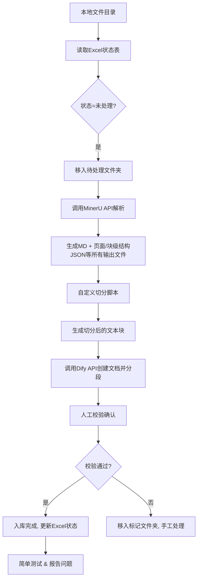

---

# 知识库批量入库自动化方案文档

> 版本：V1.0  
> 目标：实现大批量文档（PDF/Word/扫描件等）自动化解析、切分、入库，并确保内容一致性与可溯源性。

---

## 1. 整体架构与流程

**核心原则**：
- 所有流程**同步处理**，确保文档与内容一致。
- 全程**日志记录**，便于溯源与问题定位。

---

## 2. 输入与输出规范

| 项目 | 说明 |
|------|------|
| **输入** | 本地文件夹内的文档（PDF、Word、图片扫描件等） + Excel状态表（含文件名、处理状态、时间戳） |
| **中间产物** | MinerU输出的MD文件 + 页面/块级结构JSON等所有输出文件 |
| **最终输出** | Dify知识库中的文档（含分段内容） + 更新后的Excel状态表 |
| **日志** | 每步操作时间、API响应码、异常堆栈、文件路径 |

---

## 3. 详细步骤说明

### 3.1 文件读取与状态管理
- **输入**：`./input/` 目录 + `manifest.xlsx`（列：`filename, status, md5, create_time, update_time`）
- **逻辑**：
  1. 扫描 `./input/` 所有文件。
  2. 与Excel中 `status != "done"` 的记录比对，筛选未处理文件。
  3. 将未处理文件**移动**至 `./pending/` 目录（避免重复扫描）。

### 3.2 调用MinerU API解析 ✅ 已完成
- **接口**：`POST /api/parse`（已部署）
- **请求参数**：`file_path`、`output_format=md+json`
- **★ 高质量模型强制（2026-07 优化）**：
  - **默认 backend**：`hybrid-engine`（VLM + 文本提取，兼顾速度与效果）
  - **可选**：`vlm-engine`（极致精度，VLM 大模型）
  - **自动升级**：`pipeline` / `pipeline-http-client` 是低质量后端（纯 OCR，对扫描件效果差），
    开启 `RAG_MINERU_ENFORCE_HIGH_QUALITY=true` 后会被自动升级到 `hybrid-engine` 并打印 WARNING。
  - **effort 强度**：`high`（默认，极致精度 + image analysis）/ `medium`（速度优先，无 image analysis）
  - **效果排序**：`vlm-engine` > `hybrid-engine` > `pipeline`
- **★ PyMuPDF fallback（2026-07 新增，修复 GBK-EUC-H CMap 兼容性）**：
  - **触发条件**：MinerU 解析成功（HTTP 200）但产物严重缺失（v2+.md 提取字符数 < 100）
  - **场景**：旧版 PDF（Acrobat PDFWriter 5.0 + Type0 + GBK-EUC-H CMap），
    MinerU 服务端不能解码 GBK-EUC-H CMap，仅识别到 ASCII 范围的年份数字。
  - **★ Fallback 链（2026-07 升级为 2-tier）**：
    - **Tier 1（★ 推荐）**：PyMuPDF 渲染 PDF 为图片（200 DPI）→ 打包为图片型 PDF → 上传给 MinerU vlm-engine。
      VLM 走视觉路径，能识别版式、删除页码/页脚/页眉，给出准确结构。
    - **Tier 2（兜底）**：PyMuPDF 直接文本提取（无 API 调用，最快；结构较简）。
  - **实际验证**：济宁市医疗卫生机构病死婴幼儿遗体处理暂行办法（MinerU 6 字符 → Tier 2 PyMuPDF 2103 字符 → ★ Tier 1 VLM 3865 字符）
  - **产物标识**：manifest.parse 列加 `[vlm-image-fallback 修复]` 或 `[pymupdf-fallback 修复]` 后缀
  - **输出结构**：与 MinerU 一致（hybrid_auto 或 vlm/ 子目录均兼容；chunker 用 rglob 找 .md / _v2）
- **输出**：
  - `{filename}.md`：纯文本内容。
  - `{filename}.json`：包含页面边界、块级结构（标题、表格、段落、图片）、顺序化内容块列表。
  - 其他输出文件：根据需要，API文档包含更多详细信息。
- **异常处理**：失败时重试3次（指数退避），仍失败则记录日志并移入 `./error/`。

### 3.3 自定义切分策略（核心）✅ 已完成
- **输入**：`.md` 文件 + `*_content_list_v2.json` 结构文件 + `images/` 目录（图片文件夹）
- **核心策略**（按 `cutrule.md` + `cutstrategy.md`）：
  1. **区域划分**：把 v2 扁平的 blocks 划分为 `cover / toc / preface / body / appendix / reference` 六个区域。
     - 关键修复：先按"chapter-like"找到 body 起点候选，再倒推 cover 边界（避免 cover 把"第一章"吞掉）。
     - 关键修复：用 cover 区 title 集合过滤掉封面重复标题（如 WST 809 p4 重复 p1 文档名）。
  2. **正文切分（贪心合并 1级→2级→3级→句号）**：
     - L1：按章节（如"第一章"、"1 范围"）划分。
     - L2：贪心合并，目标 ≤ 1500 字符。
     - L3：单个 L2 超 1500 时，按三级标题贪心合并。
     - 句号切：仍超长则按"。"、"；"切分，添加 overlap（默认 100 字符）。
  3. **附录切分**：贪心合并（≤ 1500 字符），单附录超长时按句号切。
  4. **简单区域（cover/toc/preface/reference）**：整体为 1 段，超长按句号切。
  5. **图片内联**：`` 原生 MD 语法，去重拷贝到 `chunks/{stem}/images/`。
  6. **标题层级推断**：
     - `第X章` / `第X部分` → level-1
     - `第X条` → level-2
     - `附录 X` → appendix 起点
     - `参考文献` → reference 起点
     - `X` / `X.Y` / `X.Y.Z` → level-1/2/3
     - 文本推断优先于 v2 标注（v2 常把 1 范围 误标为 level-2）
- **输出**（`data/chunks/{stem}/`）：
  - `chunk_NNN_{slug}.md`：每个切分文件，开头为完整标题路径。
  - `chunk_metadata.json`：全部 chunk 的元数据（chunk_id/title_path/chunk_type/char_count/image_refs/is_split）。
  - `images/`：引用的图片（去重拷贝）。
- **长度控制**：
  - 目标 chunk 大小：**1500 字符**（`settings.chunk_target_chars`）。
  - 句号切分阈值：**1200 字符**（`settings.chunk_split_target`），加 100 字符 overlap（`settings.chunk_overlap`）。
- **manifest 更新**：成功 → `chunks` 列写入 stem，status=chunked；失败 → 写入失败描述，status=error。

### 3.4 调用Dify API入库
- **接口**：`POST /v1/datasets/{dataset_id}/document/create-by-text`（或对应批量接口）
- **操作步骤**：
  1. 以**文件名**命名创建空白文档（`POST /documents`）。
  2. 对每个chunk调用 **“新增分段”** 接口（`POST /documents/{doc_id}/segments`），批量提交（建议每10个chunk一次批量请求）。
- **同步保证**：每个文档所有分段全部成功后，才标记Excel状态为 `done`；若中途失败，回滚该文档所有分段。

### 3.5 人工校验确认
- **时机**：每个文档入库后（或每日批次结束后）。
- **操作**：
  - 提供Web界面，展示文档预览、分段列表、原始MD对比。
  - 校验人员点击 **“确认入库”** 或 **“检出问题”**。
  - 问题文件自动移入 `./manual_fix/` 文件夹，由人工修正后重新导入。
- **抽样规则**：默认每批次随机抽检10%，新文档类型首次全检。

### 3.6 简单测试 & 初步报告
- **测试内容**：
  - 检索Top-5准确性（用预设问答对验证）。
  - 分段内容连贯性（检查重叠窗口是否断裂）。
- **报告输出**（每批次自动生成）：
  - 总文档数、成功数、失败数、平均chunk数。
  - 平均解析耗时、入库耗时。
  - 异常文件清单及错误原因。

---

## 4. 系统搭建要求（Web形式）

| 模块 | 技术选型建议 | 功能说明 |
|------|-------------|----------|
| **后端框架** | FastAPI + Celery（异步任务） | 提供文件上传、状态查询、校验接口 |
| **前端界面** | React + Ant Design | 显示批次进度、校验预览、日志查看 |
| **数据库** | SQLite（开发）/ PostgreSQL（生产） | 存储Excel状态表、日志、校验记录 |
| **日志系统** | Python logging + ELK（可选） | 结构化日志（JSON格式），便于检索 |
| **任务调度** | APScheduler 或 手动触发 | 支持定时扫描 `./pending/` 目录 |

---

## 5. 待完成开发清单

- [✅] Web框架搭建（FastAPI + 基础路由）
- [✅] 文件处理脚本（扫描、移动、Excel读写）
- [✅] Mineru API 调用脚本（multipart/form-data，5 个 return_* 显式开启）
- [✅] 切分脚本（基于JSON结构 + 长度控制 + 图片内联）— §3.3
- [ ] Web操作逻辑（批次启动、进度展示、校验界面）
- [ ] Dify API调用脚本（含重试、批量分段、回滚）
- [ ] （后续）自动化测试脚本（用于检索效果调优）

---

## 6. 重要注意事项

> **检索方式与切分策略无关**，检索效果取决于Dify知识库的**配置方式**（如Embedding模型、检索top-k、重排序策略）。切分策略仅影响“内容是否能被正确召回”，而非“如何召回”。

- 建议在Dify中配置 **混合检索（Hybrid Search）** + **Rerank** 以提升效果。
- 若后续发现召回不佳，应优先调整Dify侧的检索参数，而非修改切分逻辑。

---

## 7. 异常处理与日志规范

- **日志级别**：INFO（常规流程）、WARNING（重试）、ERROR（失败中断）
- **关键字段**：`timestamp`、`file_name`、`step`、`status`、`duration_ms`、`error_msg`
- **日志存储**：按天轮转，保留30天。

---

## 8. 后续调优方向

- 对不同类型文档（纯文本、表格密集、扫描件）使用**差异化切分策略**。
- 引入**语义切分模型**（如基于BERT的边界检测）替代固定规则。
- 建立 **“错误-修复”反馈数据集**，用于自动优化解析参数。

---